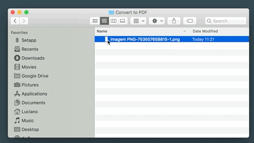
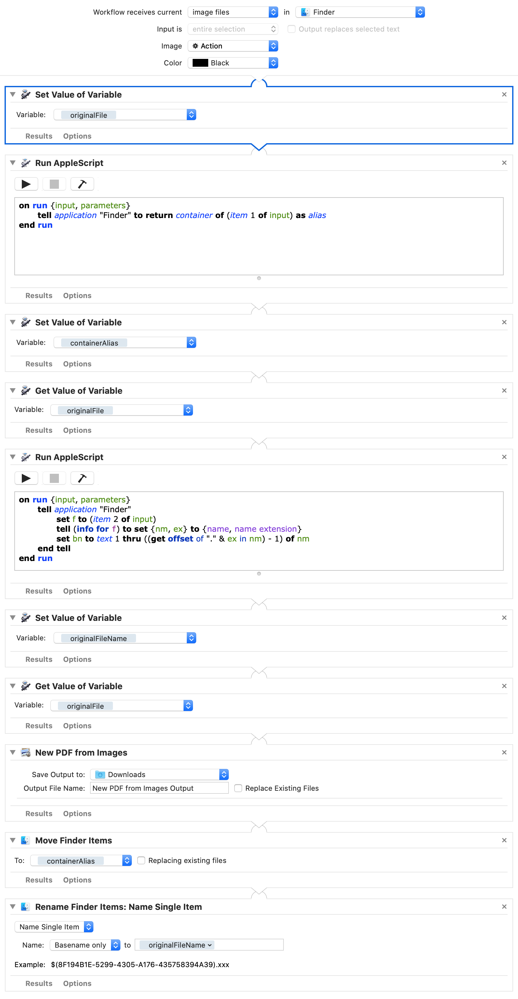

# Automator Convert to PDF (Quick Action)

macOS Automator Quick Action to convert image files to PDF.

The resulting file is saved in the container folder, with the same image file
base name, but with extension changed to `.pdf`.

I found it super helpful to quickly convert receipts received in `.png` format
which I prefer to store in `.pdf` format.

Following is a preview of the script.

